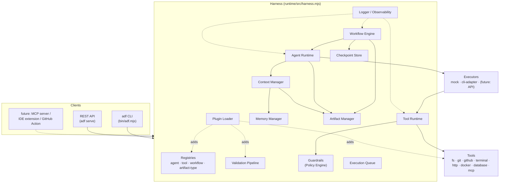

# ADF Harness Architecture

ADF is two layers now:

1. **The staged-gate methodology** (`agents/`, `workflows/`, `policies/`,
   `templates/`, `context/`) — unchanged. Product → Design → Architecture →
   Backend/Frontend → QA → Security → Operations → Code Review, each stage
   one agent, one artifact, one quality gate. See the root `README.md`.
2. **The Harness** (`runtime/`) — the Agent Runtime that actually executes
   that methodology: agent lifecycle, orchestration, tool execution,
   context, memory, artifacts, validation, retries, permissions, and
   plugins. This document describes layer 2.

Agents stay "dumb": an `agents/<id>/agent.yaml` plus `system.md` and
`instructions.md` describes what an agent is and does, in prose and
structured metadata — it contains zero orchestration logic. All the
coordination intelligence lives in the Harness.

## Component Map

## Subsystems

| Subsystem | Location | Responsibility |
| --- | --- | --- |
| **Registries** | `runtime/src/registry/` | Discover agents (`agents/*/agent.yaml`), tools (`config/tools.json`), workflows (`workflows/*.yaml`), artifact types (`config/artifact-types.json`). Nothing is hardcoded — everything is a file the registry scans. |
| **Agent Runtime** | `runtime/src/runtime/agent-runtime.mjs` | Executes one agent: builds its context, hands off to a pluggable Executor, streams progress, records produced artifacts. Owns the execution state machine (pending → running → paused/cancelled/timeout → completed/failed). |
| **Executors** | `runtime/src/executors/` | Pluggable strategy for what "running an agent" means. `mock` never calls an LLM (deterministic, used for tests/dry-runs/CI). `cli-adapter` shells out to a real AI CLI (Claude Code, Codex, ...), feeding it the agent's prompt + context over stdin. |
| **Workflow Engine** | `runtime/src/workflow/` | Executes a declarative workflow (`workflows/*.yaml`): sequential stages by default, `parallel:` stages fan out concurrently, `condition:` gates a stage on a prior stage's or artifact's status, per-stage `retry:`/`rollback:`. Checkpoints after every stage. |
| **Tool Runtime** | `runtime/src/tools/` | The one path every tool call goes through: guardrail check, timeout, bounded retries, structured logging. Built-in tools: fs, git, github, terminal, http, docker, database, mcp (config/tools.json). |
| **Context Manager** | `runtime/src/context/` | Assembles exactly what one agent execution needs: project context, policies, consumed artifacts, shared workflow memory — trimmed to a character budget when it would otherwise be too large. |
| **Memory** | `runtime/src/memory/` | One interface (`get`/`set`/`append`/`all`/`clear`), four persisted scopes (short-term/ephemeral, session, shared-per-workflow-run, long-term) plus a forward-compatible `VectorMemory` stub. |
| **Artifact Manager** | `runtime/src/artifacts/` | Every produced document/code output tracked with id, type, version, author, dependencies, status, and a full content-hash history — independent of adf-core's own file-based conventions, which it reuses rather than replaces. |
| **Validation Pipeline** | `runtime/src/validation/` | lint → unit-tests → integration-tests → security-scan → performance → build → review, each a shell command from `config/validation-steps.json`. Fail-fast by default; the Harness decides whether execution continues. |
| **Guardrails** | `runtime/src/guardrails/` | Per-tool, per-agent permission policy (`config/guardrails.json`), a hard dangerous-command regex guard that overrides even an "allow" policy, an approval hook for `ask`-policy tools, and an optional write-path sandbox. |
| **Retry / Recovery** | `runtime/src/retry/` | `RetryPolicy` (exponential backoff) and `CheckpointStore` (persist workflow run state to `.adf/checkpoints/`, survive process restarts, `adf resume`/`adf retry`). |
| **Execution Queue** | `runtime/src/queue/` | Bounded-concurrency, priority-ordered, cancellable in-process job queue. |
| **Logging / Observability** | `runtime/src/logging/`, `runtime/src/observability/` | Structured JSONL per run (`.adf/logs/<runId>.jsonl`) plus metrics aggregation, a timeline view, and a Markdown execution report with an embedded Mermaid workflow diagram. |
| **Plugins** | `runtime/src/plugins/` | `plugins/<name>/plugin.json` + an entrypoint exporting `register(ctx)`. A plugin can add an agent, tool, workflow, artifact type, executor, or validation step without any change to Harness core. |
| **CLI** | `runtime/src/cli/`, `bin/adf.mjs` | `adf run|workflow|agent|status|logs|artifacts|validate|resume|retry|doctor|plugins|serve|registry`. |
| **REST API** | `runtime/src/api/rest-server.mjs` | `adf serve` — the same Harness, over HTTP, for any future client. |

## Design Principles

- **Agents are dumb, the Harness is smart.** An agent is a prompt plus
  declared capabilities/tools/artifacts. It never decides retry policy,
  gate pass/fail, or what happens after it — the Workflow Engine does.
- **Everything discoverable, nothing hardcoded.** Agents, tools, workflows,
  artifact types, validation steps, and guardrail policy are all files.
  Adding one never requires a Harness code change.
- **Composition over inheritance.** Executors, tools, and memory backends
  are all small interfaces with swappable implementations, not class
  hierarchies.
- **Zero dependencies.** Plain Node ESM, `node:*` built-ins only — same
  constraint adf-core already operated under (see `adf-core/README.md`).
  No `npm install`, no supply-chain surface to audit.
- **One runtime, every client.** The CLI and REST API are both thin
  wrappers around one `Harness` instance (`runtime/src/harness.mjs`) — an
  MCP server, IDE extension, or GitHub Action would be another thin
  wrapper around the same thing.
- **Honest scope boundaries.** Pause/resume is real between workflow
  stages and (via SIGSTOP/SIGCONT) mid-flight for a real `cli-adapter`
  subprocess — it is not a magic mid-token pause of an opaque LLM call
  that no external CLI actually supports. Durable resume-after-restart is
  the Workflow Engine's checkpoint mechanism, not the in-process
  Execution Queue's job. See `docs/RUNTIME.md`.

## Backward Compatibility

- `adf-core/cli.mjs` and every `adf-core/lib/*.mjs` module are **untouched**.
  `node adf-core/cli.mjs <cmd>` keeps working exactly as before; the new
  `adf registry <cmd>` is a passthrough wrapper, not a reimplementation.
- Every `agents/*/agent.yaml` kept 100% of its original fields; the Harness
  only **appended** a `capabilities`/`tools`/`supported_artifacts` block
  each agent registers with (see the bottom of any `agents/*/agent.yaml`).
- `workflows/feature-development.yaml` is unmodified — same 12 stages, same
  gates, same statuses. `workflows/parallel-development.yaml` is a new,
  additive example demonstrating parallel/conditional execution; it does
  not replace anything.
- `features/**`, `policies/**`, `templates/**`, `context/**` are unchanged.
