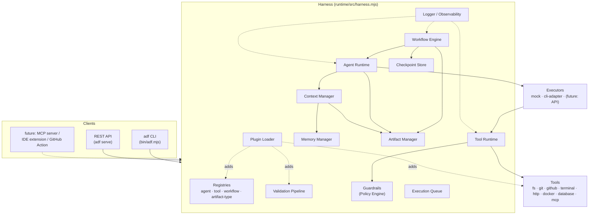
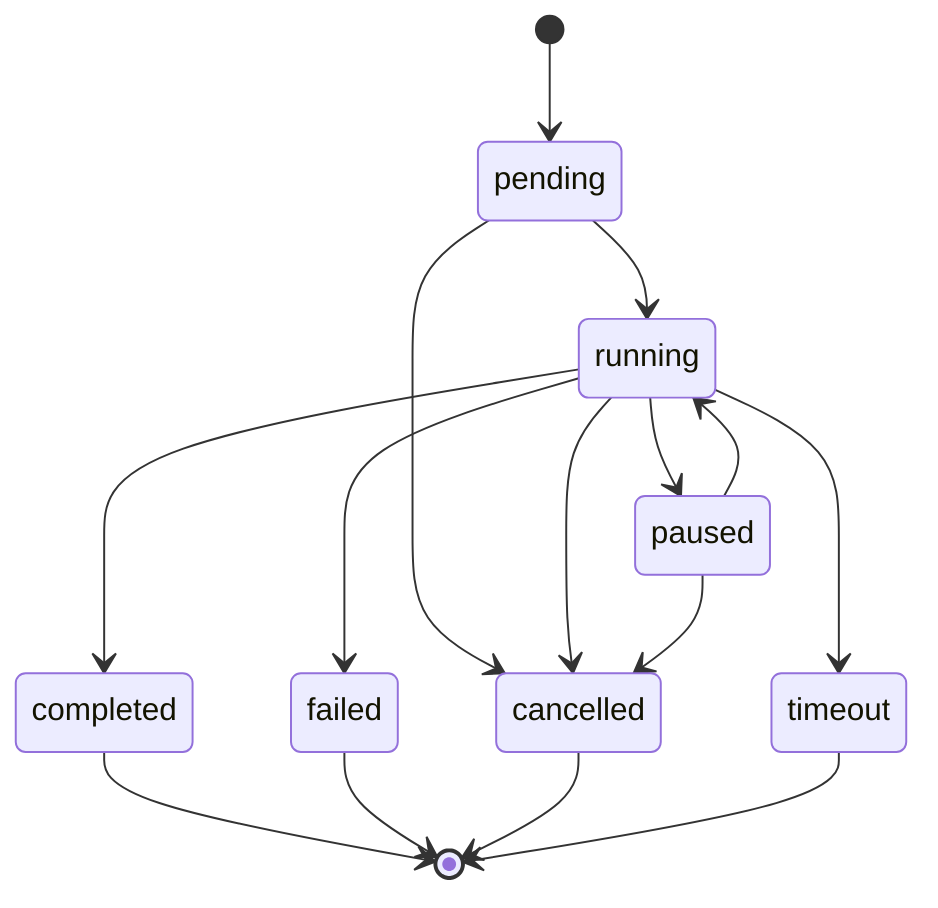
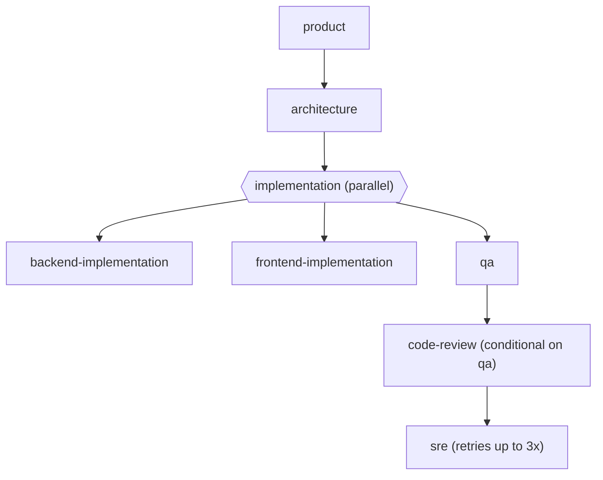
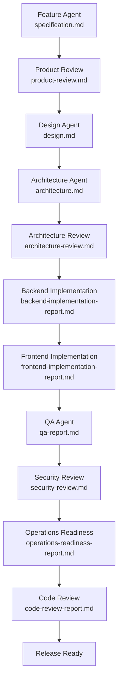

# Diagrams

Rendered copies of the diagrams embedded in the rest of `docs/` (GitHub and
most Markdown viewers render Mermaid natively — these are collected here
for a one-stop view, and to make it obvious when one drifts from its
source of truth).

## Harness Component Map

Source: `docs/ARCHITECTURE.md`.

## Agent Execution State Machine

Source: `docs/RUNTIME.md`.

## `parallel-development.yaml` Stage Graph

Source: `docs/WORKFLOWS.md`. Every real run of this workflow produces a
version of this diagram with live pass/fail markers — see `adf run
parallel-development --report` or `adf status <run-id> --report`
(rendered by `runtime/src/observability/report.mjs`).

## Sequential Feature Development Pipeline

The pre-Harness, still-canonical pipeline (`workflows/feature-development.yaml`,
described in the root `README.md`) — unchanged by any of the above.

