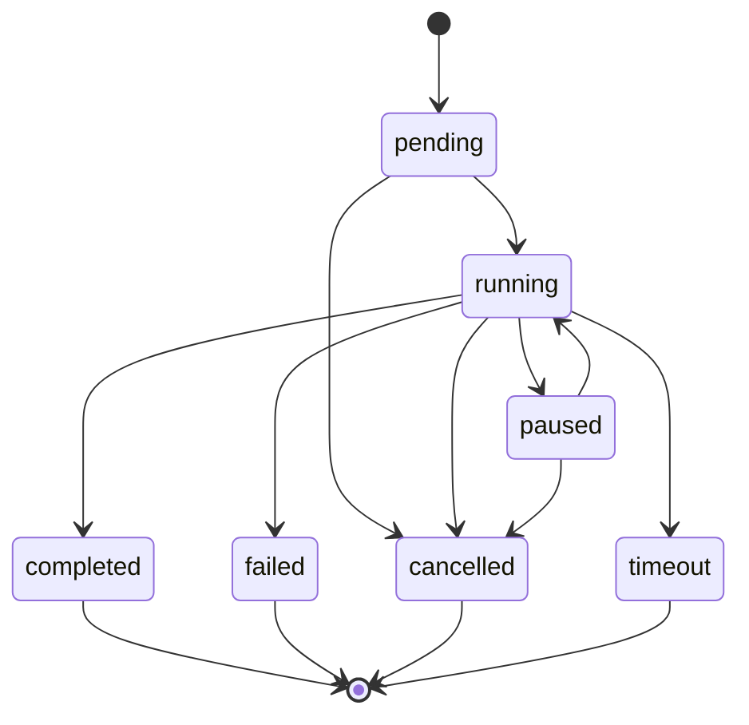

# Agent Runtime

`runtime/src/runtime/agent-runtime.mjs`. Executes exactly one agent and
tracks it through a state machine; the Workflow Engine (`docs/WORKFLOWS.md`)
calls this once per stage.

## Execution State Machine

`runtime/src/runtime/execution-state.mjs` enforces this as an explicit
transition table — an execution can never be resurrected from a terminal
state, which would otherwise be an easy source of "why did this run twice"
bugs.

## The Run Loop

1. **Build context.** `ContextManager.build()` gathers policies, project
   context, and the stage's `consumes` artifacts into one `ContextBundle`,
   trimmed to `runtime.config.json`'s implicit character budget.
2. **Resolve an executor.** By name (`--executor`, a workflow stage's
   `executor:`), or `runtime.defaultExecutor` (default: `"mock"`).
3. **Run it.** The executor is an async generator
   (`runtime/src/executors/agent-executor.mjs`) yielding `{type:
   "progress", message}` events and one final `{type: "result", content,
   artifacts}`. The Agent Runtime iterates it, checking pause/cancel state
   after every yield.
4. **Record artifacts.** For every filename the task's `produces` lists:
   if the executor returned content for it, write it to
   `<featureDir>/<filename>` and record it via the Artifact Manager; if
   the executor already wrote the file itself (a real multi-turn agent
   loop with its own tool access), just record what's on disk.

## Pause / Resume / Cancel / Timeout

- **Cancel** is always real: `AgentRuntime.cancel(executionId)` sets a flag
  checked between executor yields, calls the executor's own `cancel()`
  (which, for `cli-adapter`, sends `SIGTERM` then `SIGKILL` to the real
  child process), and aborts the shared `AbortSignal`.
- **Timeout** wraps the whole executor iteration in the configured
  `agentTimeoutMs` (default 10 minutes); on expiry it cancels the
  executor and transitions to `timeout`, not `failed` — so `adf logs` and
  `adf status` can distinguish "ran out of time" from "errored".
- **Pause/Resume** sets a flag the run loop polls between executor yields
  (every `pauseCheckIntervalMs`, default 250ms). For `cli-adapter`, pause
  additionally sends a real `SIGSTOP` to the child process and resume
  sends `SIGCONT` — a genuinely paused subprocess, not just "we stopped
  looking at its output." For `mock` (no subprocess, near-instant), pause
  only has an observable effect when the executor is configured with
  `simulateSteps` (used in tests to make timing deterministic).

**Honest scope note:** none of this pauses execution *mid-token* inside an
opaque LLM call — no external AI CLI exposes that today. What's real is
pausing *between* discrete steps of an executor's own work, and for a real
subprocess, suspending it at the OS level.

## Executors

| Executor | File | Behavior |
| --- | --- | --- |
| `mock` | `runtime/src/executors/mock-executor.mjs` | Deterministic, no network/LLM calls. For each produced `.md` filename, resolves the matching `templates/*.md` (falling back to a generic skeleton), rewrites its `STATUS:` line to the stage's gate status. Used for tests, `adf doctor`-adjacent dry runs, and demonstrating the whole Workflow Engine without any external dependency. |
| `cli-adapter` | `runtime/src/executors/cli-adapter-executor.mjs` | Spawns a configured AI CLI (`runtime.config.json`'s `runtime.executors["cli-adapter"]`, default `claude -p`), writes the agent's system prompt + instructions + task + context bundle to its stdin, captures stdout as the result. This is what makes the Harness usable with any AI CLI a project already has, not one hardcoded vendor. |

Adding a new executor (a direct API integration, a different CLI) means
implementing `AgentExecutor` (`runtime/src/executors/agent-executor.mjs`)
and calling `harness.agentRuntime.registerExecutor(name, instance)` — a
plugin can do this too (`ctx.registerExecutor`), no core change required.

## Tool Runtime

Every tool call — whether made by a real executor's own agent loop or by
the Workflow Engine's rollback action — goes through
`runtime/src/tools/tool-runtime.mjs`:

1. `PolicyEngine.authorize()` — dangerous-command regex check (always
   enforced, even under an "allow" policy), then the per-agent/per-tool
   permission (`allow`/`deny`/`ask`, `config/guardrails.json`), resolving
   `ask` through an approval hook (CLI: interactive y/N prompt when stdin
   is a TTY; otherwise `config/guardrails.json`'s
   `approvalHooks.autoApproveInNonInteractive`).
2. Load the tool module (`config/tools.json`'s `module`, lazily imported).
3. Run it under a timeout, with bounded retries — both from the tool's own
   descriptor unless the caller overrides them.
4. Log the attempt (success or failure) with `workflowRunId`, `agentId`,
   `toolCalls`, `durationMs`, `retryCount`.

See `docs/CONFIGURATION.md` for the full guardrails/tools schema.
