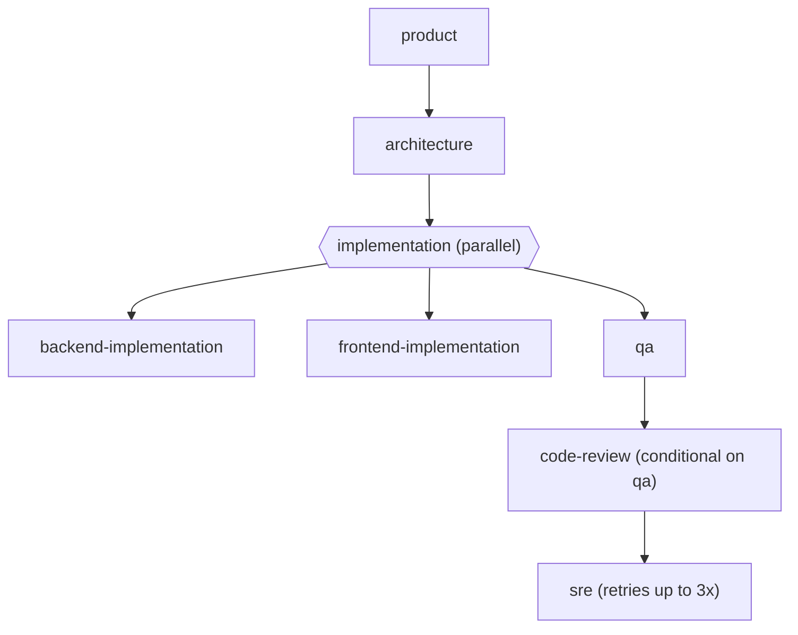

# Declarative Workflows

A workflow is a YAML file under `workflows/*.yaml`, parsed by
`runtime/src/workflow/workflow-parser.mjs` into a normalized stage graph
and executed by `runtime/src/workflow/workflow-engine.mjs`.
`workflows/feature-development.yaml` (the canonical 12-stage pipeline —
unchanged by this refactor) and `workflows/parallel-development.yaml` (a
new example) are both real, working workflows you can run today:

```sh
./adf run feature-development --feature-dir features/my-feature
./adf run parallel-development --feature-dir features/my-feature
```

## Stage Vocabulary

Every stage is one YAML list item under `stages:`. The parser recognizes:

```yaml
stages:
  - id: architecture              # required, unique within the workflow
    agent: architecture-agent     # -> "agent" stage: runs one agent
    consumes: [specification.md]  # artifact filenames/ids this stage reads
    produces: [architecture.md]   # artifact filenames this stage writes
    executor: cli-adapter         # optional: override runtime.defaultExecutor for this stage
    timeout_ms: 300000            # optional: override runtime.agentTimeoutMs for this stage
    condition:                    # optional: skip this stage unless met
      type: stage-status          # "stage-status" | "artifact-status"
      target: qa                  # a prior stage id, or an artifact id
      equals: completed           # the value target's status must equal
    retry:                        # optional: per-stage retry override
      max_attempts: 3
      backoff_ms: 2000
      backoff_factor: 2
    rollback:                     # optional: runs once retries are exhausted
      agent: some-agent           # OR: tool: <tool-id>, args: {...}
    gate:                         # optional: quality gate checked after the agent succeeds
      name: Architecture Gate
      required_artifacts: [architecture.md]
      status: READY_FOR_ARCHITECTURE_REVIEW
```

```yaml
  - id: implementation            # -> "parallel" stage: fans out concurrently
    parallel:
      - id: backend-implementation
        agent: backend-agent
        ...
      - id: frontend-implementation
        agent: frontend-agent
        ...
```

A stage with neither `agent` nor `parallel` is a **gate-only** stage — used
by `feature-development.yaml`'s terminal `release` stage, which only
checks that every prior artifact exists and carries the right status.

## Execution Semantics

- **Sequential by default.** Top-level stages run in array order.
- **Parallel.** A `parallel:` stage's branches run concurrently
  (`Promise.allSettled` under the hood) — **one branch failing does not
  cancel or discard the others' work.** If Backend fails and Frontend
  succeeds, Frontend's artifact is still recorded; the parallel stage (and
  the run) is marked failed, but nothing already-produced is thrown away.
  This is requirement-level "failure in one agent should not destroy the
  entire workflow" made concrete.
- **Conditional.** `condition:` is evaluated against the run's accumulated
  `stageResults` or the Artifact Manager — never `eval()`'d prose, so a
  workflow file can't smuggle in arbitrary code. `stage-status` checks a
  prior stage's `status`; `artifact-status` checks a tracked artifact's
  current `status` field (draft/in_review/approved/rejected/superseded).
- **Gates.** After an agent stage succeeds, its `gate.required_artifacts`
  must exist and — if `gate.status` is set — the artifact's own `STATUS:`
  line (the same convention `templates/*.md` and adf-core already use)
  must match. This reuses `adf-core/lib/fs-utils.mjs`'s
  `extractStatusLine` directly, so the Harness and `adf-core validate`
  agree on what "the status" of a document means.
- **Retry.** On agent-execution failure OR a failed gate, the stage retries
  under `RetryPolicy` (exponential backoff) up to `retry.max_attempts`
  (workflow-level default: `runtime.config.json`'s `retry` section).
- **Rollback.** Once retries are exhausted, `rollback:` runs once (an
  agent invocation, or a direct tool call) before the stage is marked
  failed — e.g. `rollback: {tool: git, args: {action: status}}` to capture
  diagnostic state, or `rollback: {agent: some-agent}` to run a cleanup
  agent.
- **Checkpoints.** After every stage (pass or fail), the run's full state
  — `currentStageIndex`, every `stageResults` entry so far — is written to
  `.adf/checkpoints/<runId>.json`. `adf resume <runId>` continues a paused
  or interrupted run from there; `adf retry <runId>` re-runs a `failed`
  run's failed stage (the checkpoint's `currentStageIndex` always points
  at the first not-yet-passed stage, so resume and retry share one
  mechanism — `adf retry` just first checks the run actually ended
  `failed`).
- **Pause/Resume/Cancel.** `WorkflowEngine.pause(runId)` /
  `.resume(runId)` / `.cancel(runId)` — checked between stages (not
  mid-stage; see `docs/RUNTIME.md` for what *is* real mid-flight).

## Example: `parallel-development.yaml`



Run it and generate this diagram (with real pass/fail markers) for any
actual run via `adf run parallel-development --report`, or `adf status
<run-id> --report`.

## Writing a New Workflow

1. Create `workflows/my-workflow.yaml` with a unique `id`.
2. List its stages using the vocabulary above — reference any agent id
   from `adf agent list`.
3. `adf workflow show my-workflow` to sanity-check the normalized graph
   before running it.
4. `adf run my-workflow --feature-dir features/<name>`.

No code changes, no registration step — the Workflow Registry discovers
every `workflows/*.yaml` file automatically.
