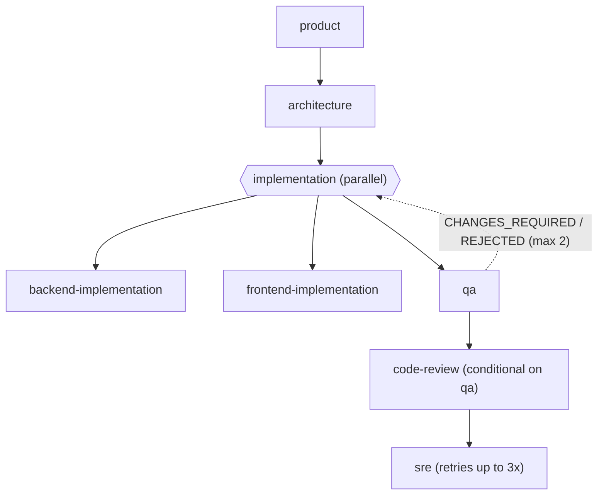

# Declarative Workflows

A workflow is a YAML file under `workflows/*.yaml`, parsed by
`runtime/src/workflow/workflow-parser.mjs` into a normalized stage graph
and executed by `runtime/src/workflow/workflow-engine.mjs`.
Three workflows ship with ADF:

| Workflow | Stages | Use it for |
| --- | --- | --- |
| `feature-development` | 11 agents + release gate | the canonical full pipeline |
| `quick-change` | 5 agents: spec → backend ‖ frontend → QA → code review | small, low-risk changes the Feature Agent classified `TRACK: QUICK_CHANGE` |
| `parallel-development` | demo of parallel/conditional stages | reference for writing your own |

```sh
./adf run feature-development --feature-dir features/my-feature
./adf run quick-change --feature-dir features/my-change
./adf run parallel-development --feature-dir features/my-feature
```

## Stage Vocabulary

Every stage is one YAML list item under `stages:`. The parser recognizes:

```yaml
stages:
  - id: architecture              # required, unique within the workflow
    agent: architecture-agent     # -> "agent" stage: runs one agent
    consumes: [specification.md]  # artifact filenames/ids this stage reads
    produces: [architecture.md]   # artifact filenames this stage writes
    executor: cli-adapter         # optional: override runtime.defaultExecutor for this stage
    timeout_ms: 300000            # optional: override runtime.agentTimeoutMs for this stage
    condition:                    # optional: skip this stage unless met
      type: stage-status          # "stage-status" | "artifact-status"
      target: qa                  # a prior stage id, or an artifact id
      equals: completed           # the value target's status must equal
    retry:                        # optional: per-stage retry override
      max_attempts: 3
      backoff_ms: 2000
      backoff_factor: 2
    rollback:                     # optional: runs once retries are exhausted
      agent: some-agent           # OR: tool: <tool-id>, args: {...}
    gate:                         # optional: quality gate checked after the agent succeeds
      name: Architecture Gate
      required_artifacts: [architecture.md]
      status: READY_FOR_ARCHITECTURE_REVIEW
      checks: [build, unit-tests]   # optional: validation steps the Harness itself runs (config/validation-steps.json)
      reject_statuses: [CHANGES_REQUIRED, REJECTED]  # default; a reviewer's "no" -> rework, never retried
      markers: ["TRACK: QUICK_CHANGE"]               # optional: exact lines every required artifact must contain
    on_fail:                      # optional (review stages): where a rejection is sent
      rework: architecture        # an EARLIER top-level stage id
      max_rounds: 2               # then the run stops for a human (default: workflow.maxReworkRounds)
    human_approval: true          # optional: override the workflow-level setting for this stage
```

Workflow-level keys next to `stages:`:

```yaml
human_approval: true   # every agent/parallel stage waits for a human decision before the next starts
track: quick-change    # optional: "Track: quick-change" is added to every agent's task
```

```yaml
  - id: implementation            # -> "parallel" stage: fans out concurrently
    parallel:
      - id: backend-implementation
        agent: backend-agent
        ...
      - id: frontend-implementation
        agent: frontend-agent
        ...
```

A stage with neither `agent` nor `parallel` is a **gate-only** stage — used
by `feature-development.yaml`'s terminal `release` stage, which only
checks that every prior artifact exists and carries the right status.

## Execution Semantics

- **Sequential by default.** Top-level stages run in array order.
- **Parallel.** A `parallel:` stage's branches run concurrently
  (`Promise.allSettled` under the hood) — **one branch failing does not
  cancel or discard the others' work.** If Backend fails and Frontend
  succeeds, Frontend's artifact is still recorded; the parallel stage (and
  the run) is marked failed, but nothing already-produced is thrown away.
  This is requirement-level "failure in one agent should not destroy the
  entire workflow" made concrete.
- **Conditional.** `condition:` is evaluated against the run's accumulated
  `stageResults` or the Artifact Manager — never `eval()`'d prose, so a
  workflow file can't smuggle in arbitrary code. `stage-status` checks a
  prior stage's `status`; `artifact-status` checks a tracked artifact's
  current `status` field (draft/in_review/approved/rejected/superseded).
- **Gates.** After an agent stage succeeds, its `gate.required_artifacts`
  must exist and — if `gate.status` is set — the artifact's own `STATUS:`
  line (the same convention `templates/*.md` and adf-core already use)
  must match. This reuses `adf-core/lib/fs-utils.mjs`'s
  `extractStatusLine` directly, so the Harness and `adf-core validate`
  agree on what "the status" of a document means.
- **Two-sided gates.** The STATUS line is only what the agent *claims*.
  A gate with `checks:` also runs those steps through the Validation
  Pipeline (the project's real build/test/lint commands from
  `config/validation-steps.json`); a failing check fails the gate no
  matter what the artifact says. A check with no command configured
  passes as **unverified** (reported per stage and by `adf doctor`) unless
  `runtime.config.json` `workflow.strictChecks` is `true`, in which case it
  fails. An unknown step id always fails. In a `parallel:` stage the
  branches' checks run once, after every branch has finished.
- **Write scope.** Before an agent stage the Engine snapshots the git
  working tree; afterwards every changed file must be inside that agent's
  `agent.yaml` `permissions.write` and outside its `permissions.deny`
  (`config/guardrails.json` `writeScope`; see docs/CONFIGURATION.md). This
  is what makes permissions binding for the cli-adapter executor, whose
  AI CLI writes files with its own tools. A violation fails the stage and
  is never retried; with `onViolation: "revert"` the offending files are
  also restored (files that already had local edits before the stage are
  never touched). Because the check diffs the whole tree, do not edit the
  same working tree while a run is in progress — use a separate `git
  worktree` for parallel work.
- **Retry.** On agent-execution failure OR a failed gate, the stage retries
  under `RetryPolicy` (exponential backoff) up to `retry.max_attempts`
  (workflow-level default: `runtime.config.json`'s `retry` section). The
  retried agent is told why its previous attempt failed.
- **Rework.** A reviewer ending with `STATUS: CHANGES_REQUIRED` or
  `STATUS: REJECTED` (or a review stage whose `checks` fail) is a verdict,
  not a flake: it is not retried. If the stage has `on_fail.rework`, the
  run jumps back to that stage and re-runs everything from there; each
  re-run agent gets a "Rework request" section in its task plus the review
  artifact in its context. After `max_rounds` rejections the run fails with
  "rework limit reached — needs a human decision". Rounds are recorded in
  the run's `history` (shown by `adf status <run-id>`).
- **Human approval.** With `human_approval: true`, after each agent or
  parallel stage passes its gate the Engine asks the interactive approver
  (`adf` on a TTY: y / N / r=reject with feedback) or, headless, parks the
  run as `awaiting_approval` (exit code 5). `adf approve <run-id>`
  continues it; `adf approve <run-id> --reject --reason "..."` re-runs the
  waiting stage with the reason as rework feedback. REST: `POST
  /runs/:id/approve`. `--auto-approve` (CLI), `autoApprove: true` (REST) or
  `workflow.approvals: "auto"` skip approvals — logged, meant for CI.
- **Rollback.** Once retries are exhausted, `rollback:` runs once (an
  agent invocation, or a direct tool call) before the stage is marked
  failed — e.g. `rollback: {tool: git, args: {action: status}}` to capture
  diagnostic state, or `rollback: {agent: some-agent}` to run a cleanup
  agent.
- **Checkpoints.** After every stage (pass or fail), the run's full state
  — `currentStageIndex`, every `stageResults` entry so far — is written to
  `.adf/checkpoints/<runId>.json`. `adf resume <runId>` continues a paused
  or interrupted run from there; `adf retry <runId>` re-runs a `failed`
  run's failed stage (the checkpoint's `currentStageIndex` always points
  at the first not-yet-passed stage, so resume and retry share one
  mechanism — `adf retry` just first checks the run actually ended
  `failed`).
- **Pause/Resume/Cancel.** `WorkflowEngine.pause(runId)` /
  `.resume(runId)` / `.cancel(runId)` — checked between stages (not
  mid-stage; see `docs/RUNTIME.md` for what *is* real mid-flight).

## Example: `parallel-development.yaml`


```mermaid
flowchart TD
  product["product"] --> architecture["architecture"]
  architecture --> implementation{{"implementation (parallel)"}}
  implementation --> backend["backend-implementation"]
  implementation --> frontend["frontend-implementation"]
  implementation --> qa["qa"]
  qa -. "CHANGES_REQUIRED / REJECTED (max 2)" .-> implementation
  qa --> code-review["code-review (conditional on qa)"]
  code-review --> sre["sre (retries up to 3x)"]
```

Run it and generate this diagram (with real pass/fail markers) for any
actual run via `adf run parallel-development --report`, or `adf status
<run-id> --report`.

## The quick-change track

`workflows/quick-change.yaml` exists so small changes are not pushed to
skip the framework altogether. It runs the Feature Agent, then a
gate-only `track-check` stage that requires the specification to contain
the exact line `TRACK: QUICK_CHANGE` (the Feature Agent decides this in
its "Delivery Track" step — no new entity or migration, no non-additive
API change, nothing security-sensitive, no new screen or integration). If
the agent wrote `TRACK: FULL`, the run stops there: use
`feature-development`. Otherwise Backend and Frontend run in parallel
against the specification alone, then QA and Code Review (which also
covers basic security hygiene, since there is no Security Review stage).
Every agent's task states `Track: quick-change`, so they do not expect
design, architecture or review documents.

## Writing a New Workflow

1. Create `workflows/my-workflow.yaml` with a unique `id`.
2. List its stages using the vocabulary above — reference any agent id
   from `adf agent list`.
3. `adf workflow show my-workflow` to sanity-check the normalized graph
   before running it.
4. `adf run my-workflow --feature-dir features/<name>`.

No code changes, no registration step — the Workflow Registry discovers
every `workflows/*.yaml` file automatically.
